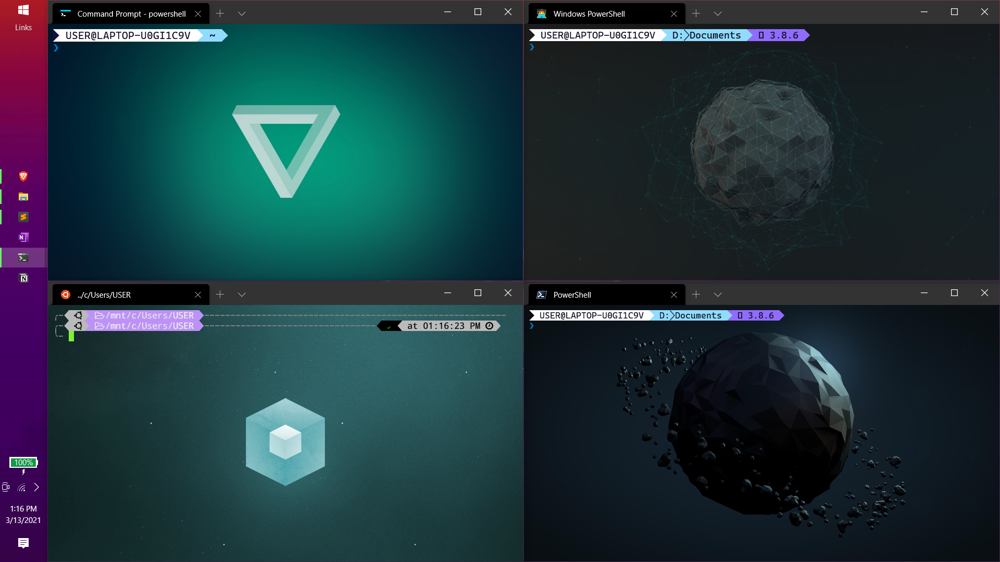
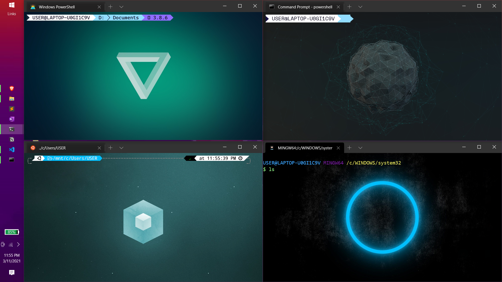
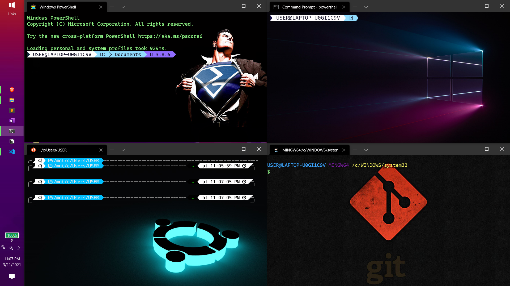
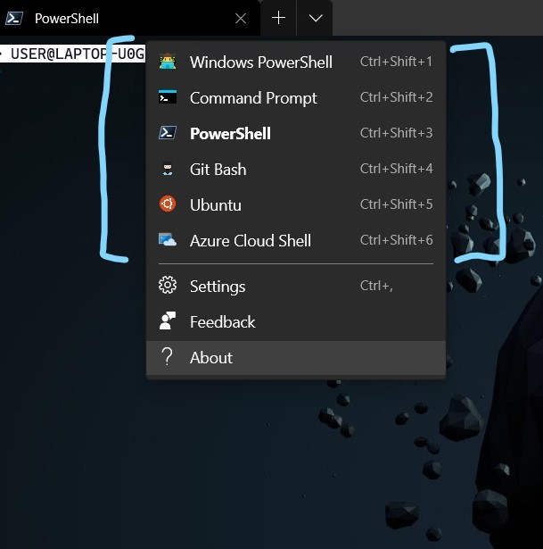

# windows-terminal-setup

I renames Microsoft.PowerShell_profile.ps1 to Microsoft.PowerShell_profile_ps5.ps1 as it belongs to the powershell 5 version it is inside C:\Users\USER\Documents\WindowsPowerShell

and version 7 of ps is in side C:\Users\USER\Documents\PowerShell

### Windows erminal Look:
 
<pre>
  
</pre>

# Total different terminals

### Features in the settings1.json of windows terminal:
1. WSL 1 added 
2. vim type lemon colored curser
3. added background pic 
4. added custom icon
5. added git
6. added powershell-7
7. custom theme

### Changes made in WSL1:
1. changed from bash to zsh
2. added p10k theme
3. added seperate plugin for auto suggestion using zsh-autosuggestion

**Video** for doing this--> https://www.youtube.com/watch?v=235G6X5EAvM&list=PLpXNRoFc3V1HC93g55Qgl9YNM_4tHaKPP&index=1&t=679s

### Changes made in powershell:
1. added custom address bar using oh-my-posh
2. added git-posh
3. added auto-suggestions based on previous history
4. added custom fonts
5. added terminal based filemanager `vifm`

**videos for setting up oh-my-posh and git-posh**:
1. https://www.youtube.com/watch?v=mnWA4EP2Zhw&list=PLpXNRoFc3V1HC93g55Qgl9YNM_4tHaKPP&index=2
2. https://youtu.be/d2urMutBGJs

**videos for enableing autosuggestions**
1. https://www.youtube.com/watch?v=I0iIZe0dUNw&list=PLpXNRoFc3V1HC93g55Qgl9YNM_4tHaKPP&index=8

**videos for installing custom font**
1. https://www.youtube.com/watch?v=x_N9gfCj8pw&list=PLpXNRoFc3V1HC93g55Qgl9YNM_4tHaKPP&index=4

**install vifm**
1. install choco -> https://www.youtube.com/watch?v=7Cp2LS9eE3c&list=PLpXNRoFc3V1HC93g55Qgl9YNM_4tHaKPP&index=15

2. install vifm -> `choco install vifm` site: https://chocolatey.org/packages/vifm

### Customizations in cmd
1. I did not do any change in cmd, just call `powershell` to summon it there and use powershell from cmd

## About `Microsoft.PowerShell_profile.ps1`:
Its the script for adding functionality in powershell, you will create one via watching the videos.
Same goes for `Microsoft.PowerShell_profile_7.ps1`

## Full playlist and blog posts that helped me to do this:
**Playlist:** https://www.youtube.com/playlist?list=PLpXNRoFc3V1HC93g55Qgl9YNM_4tHaKPP

**Blog Posts:**
1. https://shawonashraf.medium.com/charging-up-your-command-line-setup-on-windows-64b3de237c4
2. https://medium.com/@techpreacher/using-git-bash-with-the-microsoft-terminal-bd1f71fa17a1
3. https://medium.com/analytics-vidhya/customize-your-windows-powershell-with-oh-my-posh-posh-git-93284b2749b6
4. https://slmeng.medium.com/how-to-install-powerline-fonts-in-windows-b2eedecace58